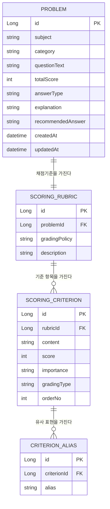

# ERD — Phase 1 채점 도메인 (Problem / ScoringRubric / ScoringCriterion / CriterionAlias)

## 개요

Phase 1(단일 문제 채점 MVP)에 필요한 최소 테이블 구조를 나타낸다.
문제 1개는 채점 기준 묶음(Rubric) 1개를 가지고, 그 아래 채점 기준 항목(Criterion) 여러 개, 각 기준마다 유사 표현(Alias) 여러 개가 붙는 구조다.

UserAnswer / ScoringResult 등 제출·이력 관련 테이블은 이번 ERD 범위에서 제외한다 (Phase 1 후반, Phase 4에서 추가 예정).

## 다이어그램

> `CRITERION_ALIAS`는 `(criterionId, alias)` 복합 unique 제약을 둔다 — 같은 기준 안에서 동일 alias 중복 등록 방지 (alias 문자열 자체는 다른 기준에서 재사용될 수 있으므로 전역 unique는 아님).

## 설명

| 테이블 | 설명 |
|---|---|
| PROBLEM | 문제 원본. subject는 초기 APPLICATION 고정, answerType은 DEFINITION/LISTING/PROCEDURE/EXPLANATION/COMPARISON/MIXED 중 하나. recommendedAnswer는 시험형 추천 답안 텍스트를 그대로 저장 (roadmap "문제당 추천 답안 1개 이상" 요구사항 대응). totalScore는 이 테이블에만 두고 SCORING_RUBRIC에는 두지 않는다 (단일 진실 소스) |
| SCORING_RUBRIC | 문제 1개당 채점 기준 묶음 1개 (1:1). gradingPolicy는 초기 KEYWORD_BASED로 시작해 이후 HYBRID로 확장 |
| SCORING_CRITERION | 실제 배점 항목. importance는 기준의 중요도(core/normal/optional), orderNo는 표시 순서. score 합은 PROBLEM.totalScore와 일치해야 함 (애플리케이션 레벨 검증) |
| CRITERION_ALIAS | 채점 기준 하나에 대해 인정 가능한 유사 표현들. KeywordMatcher가 이 테이블을 조회해 alias 매칭 수행 |

### 필드 상세

#### PROBLEM

| 필드 | 설명 | 예시 |
|---|---|---|
| subject | 과목 구분. 초기 MVP는 APPLICATION만 사용하되 값은 미리 5개 다 정의. 지금은 단순 문자열/enum이며, 과목별 개정연도·과목명 이력 관리가 필요해지는 시점(법규 과목 확장 등)에 별도 Subject 테이블로 정규화 고려 | APPLICATION, NETWORK, SYSTEM, GENERAL, MANAGEMENT_LAW |
| category | 과목 내 세부 취약점/주제. 고정 enum이 아니라 문자열로 두고 필요할 때마다 추가 (취약점 분석 시 카테고리별 집계 기준) | SQL_INJECTION, XSS, CSRF, FILE_UPLOAD, SESSION_HIJACKING, SESSION_FIXATION |
| questionText | 실제 시험 문제 지문 | "SQL Injection 공격 원리와 대응 방안을 설명하시오. [6점]" |
| totalScore | 문제 배점. 하위 SCORING_CRITERION.score 합과 일치해야 하는 단일 진실 소스 (SCORING_RUBRIC에는 중복 저장하지 않음) | 6 |
| answerType | 요구하는 서술 방식. 채점 기준을 어떻게 설계할지(나열형으로 볼지 설명형으로 볼지)에 영향 | DEFINITION(개념 정의), LISTING(항목 나열, 예: "3가지 쓰시오"), PROCEDURE(절차/순서), EXPLANATION(원리+대응 등 서술형), COMPARISON(두 개념 비교), MIXED(위 유형 혼합) |
| explanation | 관리자/학습용 해설 (왜 그런 답이 되는지) | "SQL Injection은 입력값에 대한 검증 없이 쿼리를 동적으로 조합할 때 발생한다..." |
| recommendedAnswer | 시험 답안지에 그대로 옮겨 쓸 수 있는 모범 답안 전문 | "SQL Injection은 사용자 입력값에 악의적인 SQL 구문을 삽입하여..." |

#### SCORING_RUBRIC

| 필드 | 설명 | 예시 |
|---|---|---|
| problemId | 대상 문제 FK | 1 |
| gradingPolicy | 이 rubric 전체에 기본 적용할 채점 방식 (`RubricGradingPolicy`). 개별 기준은 SCORING_CRITERION.gradingType으로 다시 지정 가능 | KEYWORD_BASED(키워드 매칭만으로 채점), SEMANTIC_BASED(의미판정 위주), HYBRID(키워드 우선 + 애매한 것만 LLM 보조) |
| description | 채점 기준 설계 의도를 남기는 관리자용 메모. 사용자에게 노출되지 않음 | "원리 서술 2점 + 대응 방안 4점(2개 이상 시 만점)" |

#### SCORING_CRITERION

| 필드 | 설명 | 예시 |
|---|---|---|
| rubricId | 대상 rubric FK | 1 |
| content | 이 기준이 확인하려는 핵심 포인트 (내부 채점 근거 문구, 사용자 노출용 아님) | "PreparedStatement 또는 바인딩 변수 사용" |
| score | 이 기준을 충족했을 때 부여할 배점 | 2 |
| importance | 기준의 중요도. 누락 시 피드백에서 어떻게 안내할지 결정 | CORE(핵심 — 누락 시 감점 사유 최우선 표시), NORMAL(일반 — 다른 기준으로 대체 가능한 보조 기준), OPTIONAL(선택 — 없어도 감점 사유로 강조하지 않음) |
| gradingType | 이 기준 하나를 판정하는 방식 (`CriterionGradingType`). rubric의 gradingPolicy가 HYBRID여도 기준별로 다르게 지정 가능 | KEYWORD(alias 매칭만으로 판정 가능한 명확한 기준), SEMANTIC(문장 의미를 봐야 하는 애매한 기준 — LLM 판정 대상), MANUAL(자동 판정 불가 — 관리자 수동 채점 필요) |
| orderNo | 피드백/화면에 노출할 표시 순서 (배점 순서와 무관할 수 있음) | 1, 2, 3 |

#### CRITERION_ALIAS

| 필드 | 설명 | 예시 |
|---|---|---|
| criterionId | 대상 채점 기준 FK | 12 |
| alias | 해당 기준을 인정할 수 있는 유사 표현. 표현 1개당 row 1개 (한글/영문/줄임말 모두 별도 row). `(criterionId, alias)` unique — 같은 기준 안에서 중복 등록 방지 | "PreparedStatement", "prepared statement", "바인딩 변수", "파라미터 바인딩", "Parameterized Query" |

### 최소 요구사항 기준으로 생략한 것

- PROBLEM ↔ SCORING_RUBRIC을 1:1로 고정했다 (문제당 채점 기준 묶음이 여러 개일 필요는 아직 없음). 나중에 버전 관리가 필요해지면 1:N으로 확장.
- NEGATIVE(오답/위험 표현) 처리용 별도 테이블 없이, 필요 시 CRITERION_ALIAS나 SCORING_CRITERION 확장으로 나중에 추가.
- 생성/수정 시각은 PROBLEM에만 두고 나머지 테이블은 생략 (관리 기능은 Phase 5에서 필요해지면 추가).
- 체감 난이도(difficulty)는 채점 로직 어디에도 쓰이지 않고 사람마다 기준이 달라 이번 ERD에서 제외.
- subject는 지금 문자열/enum 컬럼으로만 두고, 별도 Subject 테이블(과목명 이력, 개정연도 등) 정규화는 과목 확장이 실제로 필요해지는 시점(roadmap Phase 6)으로 미룬다.

## 참고

- 필드 정의 근거: [../product/system-design.md](../product/system-design.md) 1절 핵심 도메인 모델
- 범위 근거: [../product/mvp-scope-and-roadmap.md](../product/mvp-scope-and-roadmap.md) Phase 1
