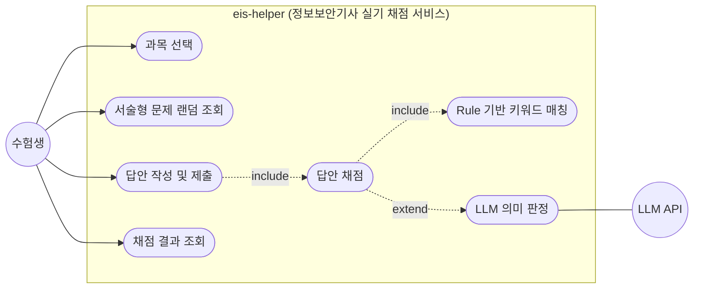
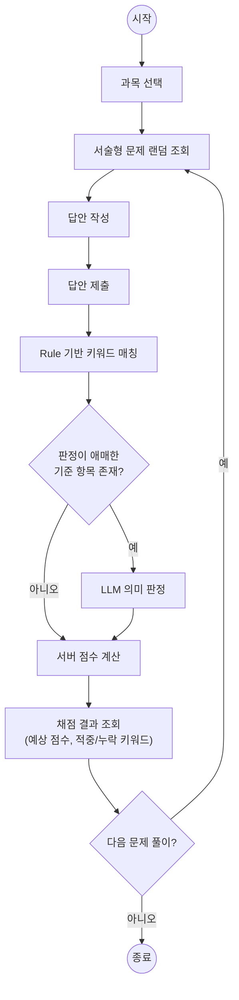

# 유스케이스 다이어그램 — 정보보안기사 실기 주관식 채점 서비스

## 개요

수험생이 정보보안기사 실기 서술형 문제를 풀고 AI 기반 채점 결과를 받는 핵심 사용 흐름을 나타낸다.

주 흐름: **과목 선택 → 서술형 문제 랜덤 조회 → 답안 작성 → 제출 → 채점 결과(예상 점수, 적중/누락 키워드) 조회**

## 액터

| 액터 | 설명 |
|---|---|
| 수험생 | 정보보안기사 실기를 준비하는 사용자. 시스템의 주 액터 |
| LLM API | 외부 AI 서비스. 키워드 매칭으로 판정하지 못한 애매한 답안의 기준 충족 여부를 보조 판단 (부 액터) |

## 다이어그램

> mermaid는 유스케이스 다이어그램 전용 문법이 없어 flowchart로 표현한다.
> 원형 = 액터, 캡슐형 = 유스케이스, subgraph = 시스템 경계, 점선 = include/extend 관계.
>
> 유스케이스 다이어그램은 "시스템이 무엇을 제공하는가"를 나타내며 **실행 순서는 표현하지 않는다** (UML 원칙).
> 유스케이스 간 순서는 아래 [사용 흐름](#사용-흐름) 다이어그램 참고.

## 유스케이스 설명

| 유스케이스 | 설명 |
|---|---|
| 과목 선택 | 정보보안일반, 애플리케이션 보안 등 과목을 선택한다. MVP에서는 애플리케이션 보안만 활성화 |
| 서술형 문제 랜덤 조회 | 선택한 과목의 서술형 문제 중 하나를 랜덤으로 받는다 |
| 답안 작성 및 제출 | 주관식 답안을 작성해 제출한다. 제출 시 채점이 수행된다 (include) |
| 답안 채점 | 채점 기준(Rubric)에 따라 답안을 평가하고 서버가 최종 점수를 계산한다 |
| Rule 기반 키워드 매칭 | 정답 키워드와 유사 표현(alias)을 매칭한다. 채점의 기본 경로 (include) |
| LLM 의미 판정 | 키워드 매칭으로 판정이 애매한 항목만 LLM이 기준 충족 여부를 판단한다. 선택적 경로 (extend) — LLM 장애 시에도 Rule 기반 결과는 반환 |
| 채점 결과 조회 | 예상 점수와 점수 근거(적중 키워드, 누락 키워드, 부분 인정 항목)를 확인한다 |

## 사용 흐름

수험생 관점의 한 사이클을 순서대로 나타낸다. 유스케이스 다이어그램이 담지 않는 실행 순서와 채점 내부 분기를 보여준다.

- 채점(키워드 매칭 → LLM 판정 → 점수 계산)은 제출과 결과 조회 사이에서 서버가 수행하는 내부 단계다.
- LLM 판정은 애매한 항목이 있을 때만 수행되며, LLM 장애 시에도 Rule 기반 결과로 점수를 반환한다.
- 결과 확인 후 같은 과목에서 다음 문제를 이어서 풀 수 있다 (과목 재선택은 선택 사항).

## 참고

- 채점 원칙(AI는 판단만, 점수 계산은 서버)은 [../product/service-design.md](../product/service-design.md) 참고.
- 풀이 이력 조회, 취약점 분석 유스케이스는 Phase 4에서 추가 예정 ([../product/mvp-scope-and-roadmap.md](../product/mvp-scope-and-roadmap.md)).
